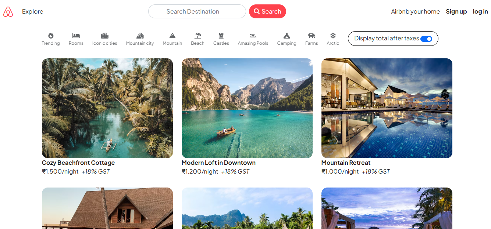
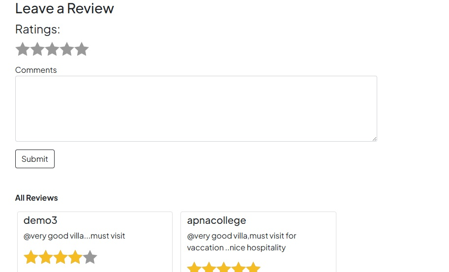

# Wanderlust 🌍

A full-stack travel listing web application where users can create, view, and review destinations. Built using the MERN stack (without React), Wanderlust follows the MVC architecture and integrates features like user authentication, session management, map API, and reviews.

---

## 🚀 Features

- 🧭 Browse and create travel listings
- ✍️ Post and manage user reviews
- 🔐 Authentication and session handling using **Passport.js**
- 📍 Interactive location maps via **Map API**
- 💾 Persistent data with **MongoDB**
- 🎨 Responsive UI using **Bootstrap**
- 🍪 Session tracking with **cookies**
- 🧱 Clean structure with **MVC architecture**
- ☁️ Ready for deployment on **Render**

---

## 🛠️ Technologies Used

- **Frontend**: HTML, CSS, Bootstrap
- **Backend**: Node.js, Express.js
- **Database**: MongoDB, Mongoose
- **Authentication**: Passport.js, express-session
- **Other**: Map API, MVC architecture

---
## 🖼️ Screenshots
<!-- Centered container for screenshots -->
<div align="center">
  <!-- Home Page Image -->
  <h2>Home Page</h2>
  
  
  <!-- Review Page Image -->
  <h2>Review Page</h2>
  
  
  <!-- Two images side by side -->
  <p>
    
    
  </p>
</div>

## 📁 Project Folder Structure (MVC)
```plaintext
wanderlust/
├── models/        # Schemas
├── routes/        # Express routes
├── views/         # Templates
├── public/        # Static files
├── controllers/   # Logic
├── utils/         # Helpers
└── app.js         # Entry


---

## 🧰 Installation

```bash
# Clone the repository
git clone https://github.com/nityatripathi019/wanderlust.git
cd wanderlust

# Install dependencies
npm install

# Set up environment variables in a .env file
# Example:
# DB_URL=your_mongodb_uri
# SESSION_SECRET=your_secret_key
# MAPBOX_TOKEN=your_map_api_token

# Start the server
node app.js


